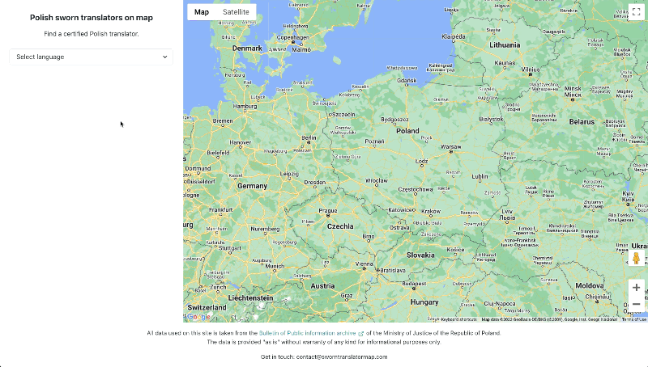

# Sworn translator map

Polish sworn translators on map.

https://sworntranslatormap.com



# Development

## Configuration

Run with `--help` or check out [config.go](./internal/config/config.go) for configuration options.

## Deployment

See included [docker-compose.yml](./docker-compose.yml) for a deployment example.

## Local run

Run the following processes:

```
./
go run main.go server
go run main.go scraper

./web
npm run dev
```

To regenerate and compile translations run:

```
npm run i18n
```
